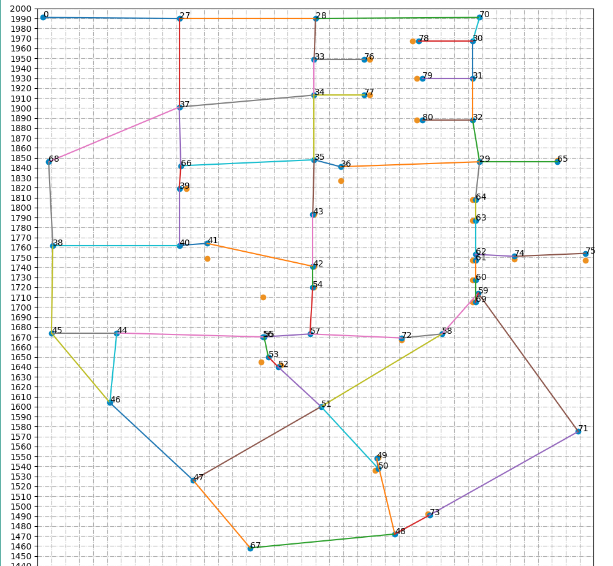
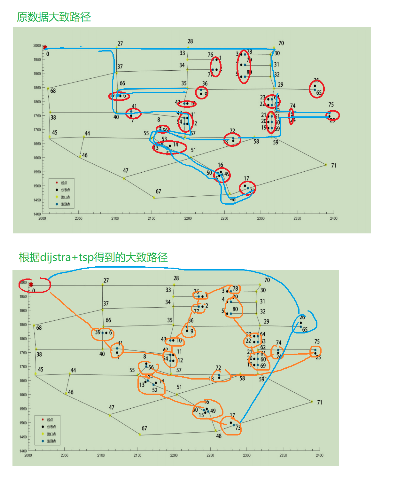
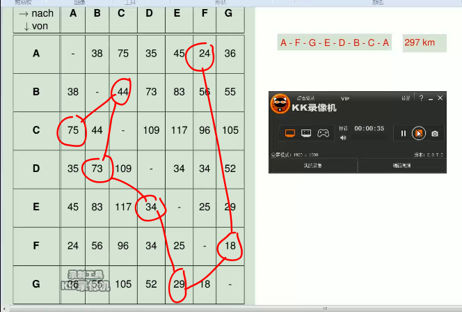

# path-planing

一个路径规划问题，用到了 dijkstra 和 旅行商TSP 算法

---

补充：在 `deadline/` 文件夹中使用 a* + tsp 算法


---

参考连接：

- dijkstra
  - https://haokan.baidu.com/v?pd=wisenatural&vid=1146937591908032169
- tsp
  - https://www.cnblogs.com/larryking/p/5734459.html
  - https://www.bilibili.com/video/av417137546/


---

程序文件：
- `DataProcess.py` 处理json文件和dict对象
- `DistanceUtil.py/DistanceCalculator` 该类用来计算边的权值，并写入 edges2.json
- `learnDijstra/demo.py/dijkstra_demo` 该类实现 dijkstra 算法，计算某一点到其他点的最短距离和路径
- `CalShortestPathsForEachPoints.py/my_calculation` 该类计算所有点到其他点的最短距离和路径，将结果存入`shortestpaths.json` 中
- `MatplotlibDemo.py` 使用 matplotlib 绘制原图形
- `tsp_demo.py` 最终 计算路径结果的 文件，即根据 `my_calculation` 类算出的每个点到其他点的最短路径矩阵，再根据 tsp贪心算法计算最短路径


数据文件：

- `data.json` 录入的记录原始点的信息
- `edges.json` 录入的记录原始的边信息，没有权值
- `edges2.json` 经过计算的边信息，带有权值
- `shortestpaths.json` 记录最终得到的每个路径点到其他路径点的最短距离和路径


### **大致地图**



**TSP 结果**



### 核心算法

#### dijstra

- checked 列表是最优路径点，表示已经计算过的点

- unchecked 列表表示非最优路径点，其中的点的路径可能不是最优的，处于中间过程

- self.path[p] 字典用来记录 p 为出发点的最短路径

- self.dist[p] 字典用来记录 p 为出发点的最短路径距离

```python
unchecked = []  # 未标记的集合
checked = []  # 最优路径节点
unchecked.append(p)
self.path[p] = p
self.dist[p] = 0

while len(unchecked) != 0:
    # 找出 unchecked 中距离距离出发点最近的点
    min_dis = np.inf
    min_point = np.inf
    for k, v in self.dist.items():
        if v < min_dis and k not in checked:
            min_dis = v
            min_point = k
    if min_point == np.inf:  # 从未标记的点中没找到离出发点最近的点
        break
    checked.append(min_point)
    unchecked.remove(min_point)
    # 将找到的节点的邻接点加入得到 未标记的集合，同时更新路径
    for k, v in self.graph[min_point].items():

        if k in checked: # 排除已标记的点，防止死循环
            continue

        if min_dis + v < self.dist[k]: # 路径优化
            self.dist[k] = round(min_dis + v, 3)
            self.path[k] = min_point
            if k not in unchecked:
                unchecked.append(k)

print(self.dist)
print(self.path)
```


#### **tsp**


示例，每个点到其他点的距离，对应到地图上就是每个建议观察点到其他观察点的距离，A点出发最终回到A的最短路径



**tsp_demo.py 核心代码**

```python
path = []  # 拟路径, int
cur_no = start_no = 0
path.append(cur_no)
remaining = TOTAL_POINT_NUM  # 27
while True:
    if remaining == 1:
        path.append(start_no)
        break
    # 从 graph_matrix[cur_no] 中找距离 cur_no 最近的点
    min_dist = np.inf
    min_point = ''
    for p, d in self.graph_matrix[cur_no]['dist'].items():
        p_int = int(p)
        if d != -1 and p_int not in path and d < min_dist:
            min_dist = d
            min_point = p_int
    if min_dist != np.inf:
        cur_no = min_point  # 距离 cur_no 最近的未经过的点
        path.append(min_point)
        remaining -= 1
print('起点为' + str(start_no) + '，经过所有检测点的最短路径是：')
print(path)
```


