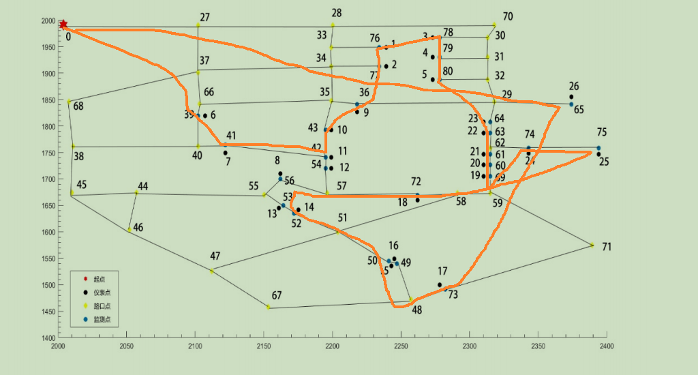
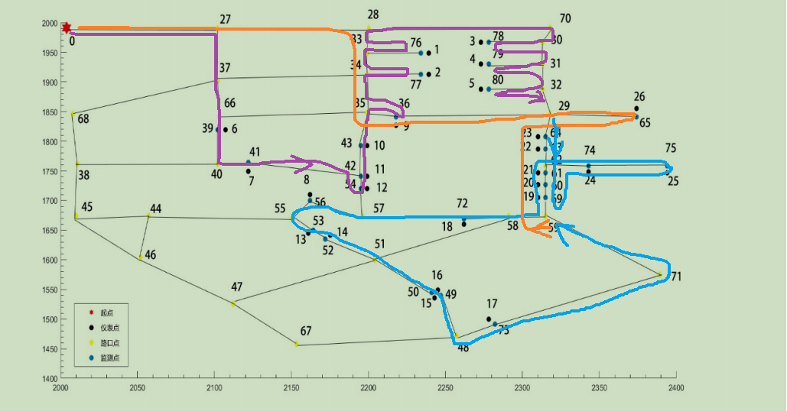
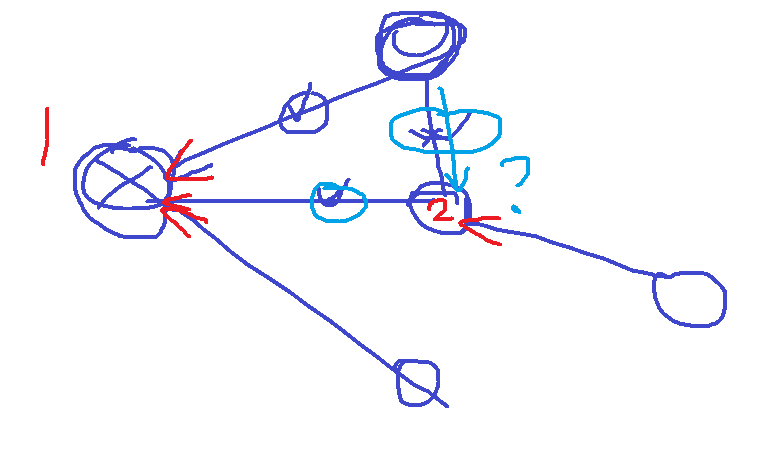

> 平台上的 A* 算法：可以在一个无向有权图中计算 开始点 a 到 结束点 b 的最短路径及距离
>
> 代码：code/astar.py


### 迁移到本题中

- 可以根据**坐标点**计算出**路径点之间的权值**，放弃栅格
- 算出所有边的权值之后，可以算出所有点的**邻接矩阵**（仪表点不与其他任何点相邻）
- 上边的条件可以使用 a* 算法计算**任意两个路径点之间的最短路径和距离**
- 全部代码在 `calc/a_star.py` 中

```python
def all_astar_for_all_path_points():
    graph = init_graph()
    h = [0 for i in range(PLACES_NUM)]
    points = loader.load_json_to_dic('resources/data.json')
    new_list = []  # 存放 a* 算法计算出的路径点之间的最短路径及路径长度
    for start in range(PLACES_NUM):
        a_dic = {'no': start, 'type': checker.get_spec_point_by_no(points, start)['type']}
        to_dic = {}
        for end in range(PLACES_NUM):
            if start == end:
                continue
            p = checker.get_spec_point_by_no(points, start)
            q = checker.get_spec_point_by_no(points, end)
            if checker.is_path_point(p['type']) and checker.is_path_point(q['type']):  # 都是路径点
                cost, path = a_star(graph, h, start, end)
                to_spec_dic = {'cost': round(cost, 3), 'path': path}
                to_dic[end] = to_spec_dic
        a_dic['to'] = to_dic
        new_list.append(a_dic)
    return new_list
```

计算结果：`32号点的部分数据`

```json
{
    "no": 32,
    "type": 3,
    "to": {
        "0": {
            "cost": 417.524,
            "path": [
                32,
                31,
                30,
                70,
                28,
                27,
                0
            ]
        },
        "27": {
            "cost": 319.519,
            "path": [
                32,
                31,
                30,
                70,
                28,
                27
            ]
        },
        "28": {
            "cost": 221.519,
            "path": [
                32,
                31,
                30,
                70,
                28
            ]
        },
        "29": {
            "cost": 42.297,
            "path": [
                32,
                29
            ]
        }
    }
}
```


虽然使用了旅行商算法，但每个监测点可能出现经过两次及以上：在 TSP 算法中使用监测点间的最短路径作为计算依据，而监测点之间还可能有监测点







### A* 算法核心

```python
def a_star(graph, h, _root, _goal):
    parents = [-1] * PLACES_NUM  # temporary parents             现阶段搜索过程中的每个节点的父结点记录@
    pq_open = PriorityQueue()  # open queue                     初始化open表@
    q_close = Queue()  # closed queue                           初始化closed表@
    pq_open.put([_root, 0])  # 将初始结点存入OPEN表中@

    while not pq_open.is_empty():
        parent_node = pq_open.get()  # 获取cost最小点
        q_close.put(parent_node[0])  # 将open表中的cost最小的节点放入close表
        if parent_node[0] == _goal:  # cost最小的节点是否是目标节点
            break
        for i in range(20):  # 拓展cost最小的节点
            length = graph.get_edge(parent_node[0], i)
            if length != 0:  # 边 (i, parent_node[0]) 存在
                node, result = pq_open.contain(i)  # 查看open表中知否已经存在该节点

                # 计算代价？？？
                f = parent_node[1] + length + h[i] - h[parent_node[0]]  # 计算 cost

                if q_close.contain(i):  # 节点 i 已经在 close表中
                    continue
                elif result:  # 节点 i 在open表中，需要重新估算节点
                    if node[1] > f:  #
                        pq_open.remove_val_and_cost(node[0])  # 完整删除
                        parents[i] = parent_node[0]  # i节点来自cost最小点即parent_node[0]
                        pq_open.put([i, f])
                else:  # 节点i不在open表中，则需要加入
                    parents[i] = parent_node[0]  # i节点来自cost最小点即parent_node[0]
                    pq_open.put([i, f])
```

计算代价一步，`h[i] ` 表示在节点 i 的代价（某个中间变量 **？**）

**f    =    parent_node[1]    +    length    +    h[i]    -   h[parent_node[0]]**



1. 1 为出发点，节点 1 在 open 表中，遍历他的临界点，临界点的父节点即为 1，此时它的三个临界点都加入 open 表中。然后将节点 1 放入 close 表中
2. 假设 open 表中的节点 2 的 cost 最小，那么此时应该找 结点2 的临界点，1 已经在 close 表中，忽略；上边的结点在 open 表中，此时需要判断是否可以优化路径即如果 cost 更小则进行优化；右边的结点即不再 open 表也不在 close 表，应该在节点 2 的基础上（以 2 父父节点）计算代价加入 open 表

具体：

- parent_node[0] 代表当前 open 表中花费最少的点，即为 2 
- parent_node[1] 代表 open表中花费最少的点的花费，即开始节点 1 到结点 2 的花费
- 不考虑 h数组附加属性，都当成 0 时 `f = parent_node[1] + length` 就单单代表路径消费

